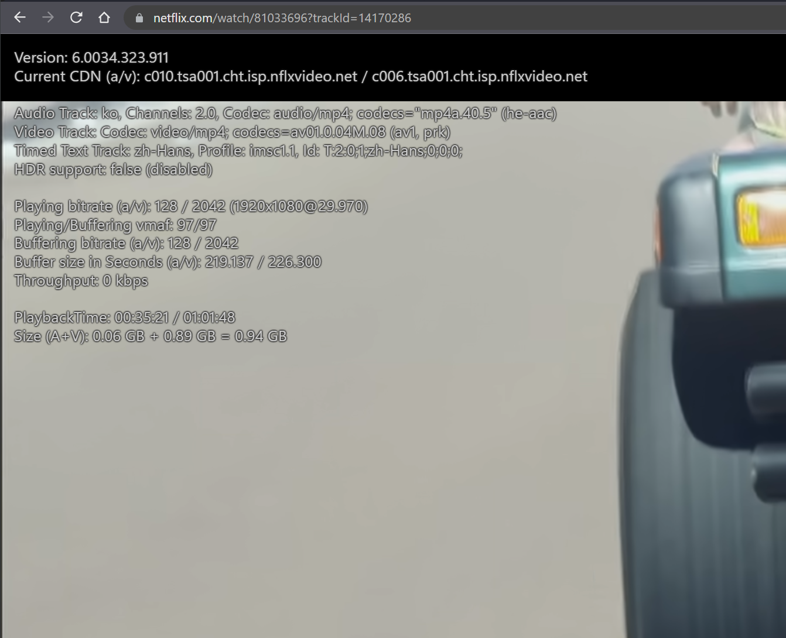
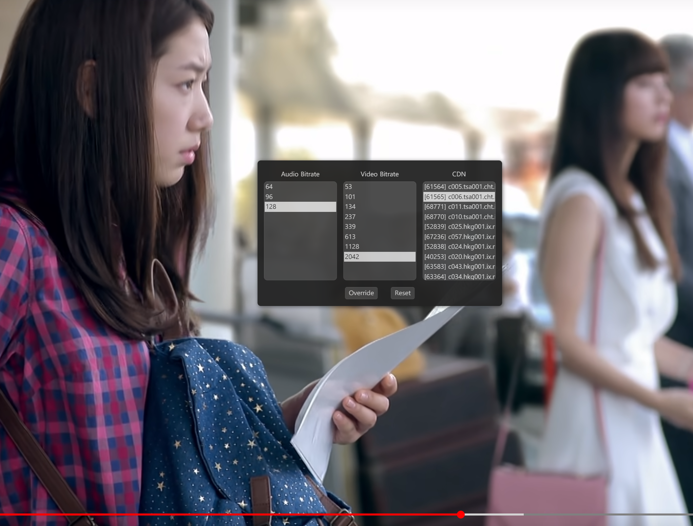

thanks to https://github.com/truedread/netflix-1080p

Microsoft Store:  
https://microsoftedge.microsoft.com/addons/detail/oikpkeeoofpiapmjioabikmgjeaoggcn

**This extension provides the following functions**  
1, all languages (audio and sub,if any)   
2, Automatically select best bitrate available    
    
        
--------------------------------------------------------------------------------------

**In different hardware/software, your experience is different**  
    
  
**In win10-64bit>1909 and edge browser(Non-portable)**  
1, Max 4K.  [<u>**About 4K**</u> ](https://help.netflix.com/zh-tw/node/13444)      
2, DDplus, Atmos(if any) Audio   
3, Use AVC, NOT AvcHigh video code   
4, Use "Dolby Vision" Profiles for HDR (May need NVIDIA 20 series and above graphics cards, and Dolby Vision TV)   
5, Use HEVC code, Downgrade from 4K to 1080P   
    
    
  
**Other OS And Browser(Includes portable edge)**  
1, Max 1080P   
2, HE-AAC Audio (lower than DDplus)   
3, AV1/VP9/AVC/AVC-High codecs can be use (Not all video support all of them, try different choice)
  

**快捷键(Shortcuts)**
- ~: 视屏信息 (Video info)
- x: 比特率选择框 (Bitrate selet)
- w/s: 声音调节 (Volumn Control)
- q/e/a/d/z/x: 快进/快退 (Fast Forward/Backward) 15s/5s/10s
    
ATMOS is very, very amazing  
https://www.netflix.com/search?q=ATMOS  
enjoy
    
    
--------------------------------------------------------------------------------------

